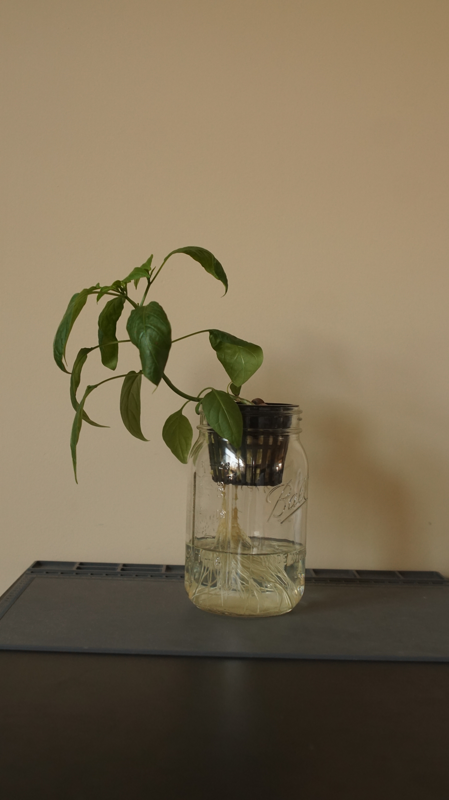
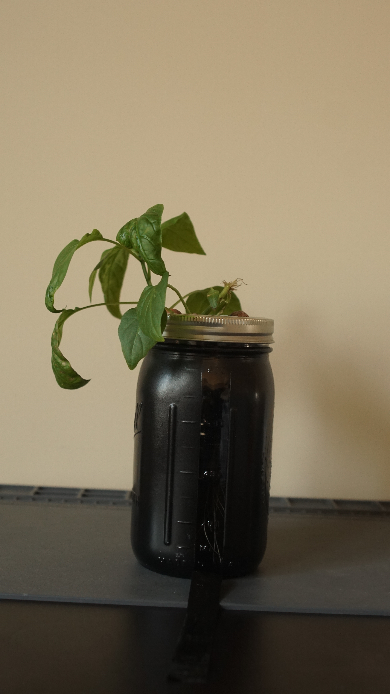
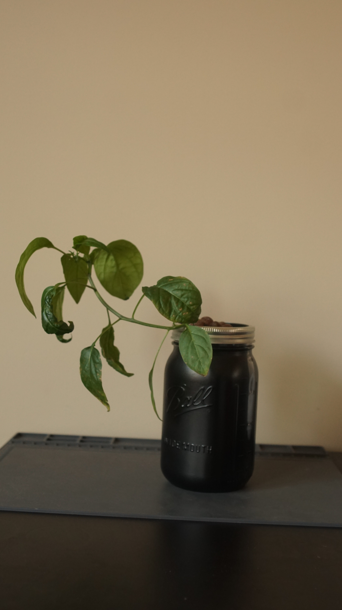

# Jalapeno Grow Log

Started 4 seeds using the paper towel method August 27, 2021 

Left the seeds in my car glove box hoping it will stay hot enough

Temperatures have been around 30°C  during the day but dropping into the 20s at night... I suspect I will need a heat pad

September 9, 2021 started 5 seeds in a paper towel in a plastic bag with my new grow mat

the grow mat has a temperature regulator that I set to 83°F which is comfortably in the 80-85°F range that is recommended for the jalapenos to grow

Hopefully we will see results in two weeks, tomorow will be two weeks for the car seeds

September 22, 2021 Transplanted 4 sprouts into mason jars

The heating mat was very effective and sprouted 5 sprouts/5 seeds

I mixed the nutrients in my insant pot because it was the largest container I had. I eyeballed 1 tsp to a gallon because I don't have a tsp measure. 

The ph up and down only need a few drops for a big change. 

I let the spouts go for a little too long possibly because they were long and very light yellow green leaves. In the future I might not cover them with a blanket to see if that causes them to start with a darker green. 

I need to find a way to cover the two extra mason jars so no light can get in because I wasn't anticipating having extra to grow so I only spray painted 2. 

December 12, 2021 Topped off water in all 4 plants

One is not doing good, it didnt grow roots

The other 3 have all grown roots

They are all leaning heavily in the direction of the window

I think they all have tiny flower buds (except the one thats not doing well)

January 15, 2022 

I got back from break yesterday so the plants had not been watered in 3 weeks

all of them had drunk their water down to about the bottom 1/4 of the jar

except the weak plant which died completely. 

The plant in the cloth covering has many buds that are developing but none of them were opening when I arrived. Now that they have been watered (still with the grow solution - next I will switch to bloom) one flower is starting to open up. 

The other two plants in the painted jars have flower buds starting but they are all very tiny still. 

Overall they all look pretty healthy. They have some brown spots on their leaves but nothing that seems concerning as of yet.